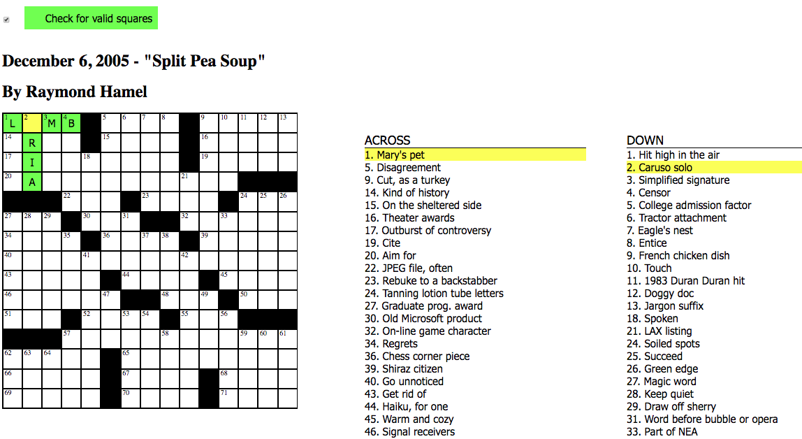

# CrosswordsInteractive
[IN THE WORKS] This is a front and back-end project for a crossword puzzle website, using HTML, Python, Jinja and Flask.

This project began in December, 2018 and is still on-going. 
It will become an interactive crossword site where multiple people may fill in a crossword simultaneously from different computers. 

**Important files:**
  1. applications.py : The main python application file, linked to puz.py 
	2. CW.html : The main html file
  3. puz.py : Crossword parser, taken from alexdef/puzpy, found here https://github.com/alexdej/puzpy/blob/master/puz.py
  CW.html : main html page

**Example:**

**Testing:** 
Some puzzles (.puz files) are available in the /testfiles folder. These puzzles allow for integration testing. The project defaults to using 15by15.puz, which exists in /testfiles. To test different puzzles, you can go to applications.py and edit line 12 ("p = puz.read('testfiles/15by15.puz'") by inserting the name of your prefered .puz file over "15by15.puz".
